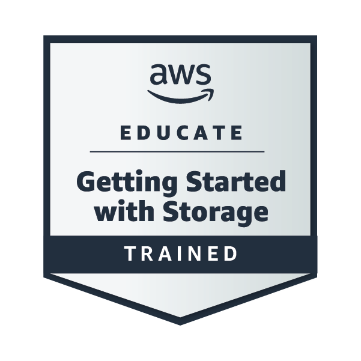

# 👋 Fala aí! Eu sou o Serjão

💻 Desenvolvedor **Front-End** que curte transformar café em código e ideias em interfaces.  
🚀 Viciado em React, UX e boas práticas.  
☁️ Certificado pela **AWS** — porque nuvem também é lugar de dev!

---

### 🧠 Um pouco sobre mim
- 🔧 Trabalho com **React**, **Node.js**, **PostgreSQL** e o que mais fizer sentido pro projeto  
- 🎯 Foco em **usabilidade**, **performance** e **código limpo**  
- 🎨 Sempre tentando deixar a web mais bonita (e funcional)  
- 🎧 Quando não tô codando, tô ouvindo podcast de tech ou música pra manter o flow  

---

### 🛠️ Stack e ferramentas

  

---

### 🏅 Minhas Badges AWS

  <!-- substitui as URLs abaixo pelas tuas badges reais da AWS -->
  
  

---

### 📈 Estatísticas do GitHub

  
  

---

### 📫 Onde me encontrar
- 🌐 [Portfólio](https://portifolio-git-main-sergiosousacodes-projects.vercel.app/)
- 💼 [LinkedIn](https://www.linkedin.com/in/sergiosousa-tec/)
- 📚 [DIO](https://web.dio.me/users/sergioturgeo?tab=achievements)
- 📧 **sergio.sousa.code@gmail.com**

---

> 💬 “Build. Break. Fix. Repeat.”  
> — mantra diário de um dev feliz ☕
